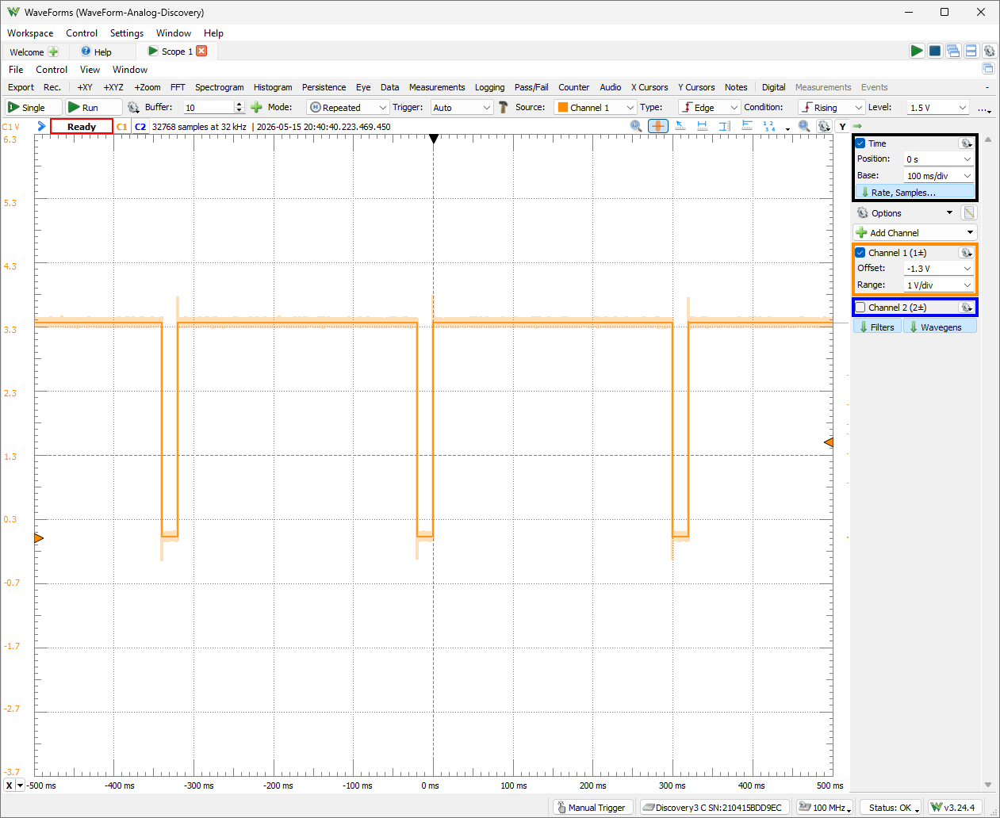

# PMOD — Saída NRZ-L para Analog Discovery

Variante do projeto NRZ-L principal que adiciona saída serial pelo conector **PMOD JA1** da Basys 3, permitindo visualizar a forma de onda modulada em tempo real com o **Analog Discovery 3** (ou qualquer osciloscópio conectado ao pino).

## Estrutura desta pasta

```
PMOD/
├── src/                Código-fonte VHDL
├── sim/                Testbench e configuração de waveform
├── constraints/        Mapeamento de pinos (.xdc) com PMOD JA1
├── vivado_project/     Script Tcl para recriar o projeto e bitstream
└── docs/               Documentação adicional (esquemáticos, capturas)
```

## Diferenças em relação ao projeto principal

Este subprojeto modifica dois arquivos do projeto base (`nrz_l/`):

- **`src/top_nrz_l_basys3.vhd`** — Estendido com suporte a clock, porta de saída para o PMOD JA1 e lógica de serialização temporizada. Na NRZ-L, emite diretamente o valor de cada switch pelo pino JA1 — sem lógica de transição. Duração de 20 ms por bit, 320 ms por sequência completa
- **`constraints/basys3_nrz_l.xdc`** — Estendido com o mapeamento do clock da placa e do pino PMOD JA1

Os demais arquivos (`src/nrz_l.vhd` e `sim/tb_nrz_l.vhd`) são idênticos aos do projeto principal.

## Arquivos de código

- **`src/nrz_l.vhd`** — Encoder NRZ-L com FSM (idêntico ao projeto principal)
- **`src/top_nrz_l_basys3.vhd`** — Top-level com saída para LEDs e serialização síncrona para o PMOD JA1
- **`sim/tb_nrz_l.vhd`** — Testbench do encoder (idêntico ao projeto principal)
- **`constraints/basys3_nrz_l.xdc`** — Mapeamento de pinos da Basys 3, incluindo clock e pino PMOD JA1

## Por onde começar

### O que você vai precisar

- Placa Basys 3 conectada ao computador via cabo USB
- Analog Discovery 3 com o software **WaveForms** instalado, ou qualquer osciloscópio com ponteiras
- Vivado instalado com suporte a dispositivos **7 Series** (Artix-7)

### Conexão física antes de ligar

Antes de gravar o bitstream, faça as conexões:

1. Localize o conector **PMOD JA** na Basys 3 (lateral esquerda da placa)
2. Conecte o fio de sinal (canal 1+, laranja no Analog Discovery) ao pino **JA1** (pino superior esquerdo do conector)
3. Conecte o GND (fio preto) ao pino GND do mesmo conector (pino inferior esquerdo)
4. Conecte a Basys 3 ao computador via USB e ligue a chave de energia da placa

### Simulação rápida (sem a placa)

Se quiser verificar o comportamento do encoder antes de gravar na placa:

1. Abra o Vivado
2. Abra o Tcl Console pelo menu **View → Tcl Console**
3. Navegue até `vivado_project/` e execute o script (veja a seção [Recriar o projeto Vivado](#recriar-o-projeto-vivado) para o passo a passo completo)
4. Clique em `Run Simulation` → `Run Behavioral Simulation`
5. Carregue `tb_nrz_l_behav.wcfg` na janela de waveform para visualizar os sinais já configurados
6. Observe o sinal `nrz_out`: na NRZ-L, a saída reproduz diretamente o valor de cada bit — `1` resulta em nível alto, `0` em nível baixo, sem lógica de transição

> A simulação cobre apenas o encoder NRZ-L (`nrz_l.vhd`). A serialização temporizada do top-level e a saída PMOD não são simuladas pelo testbench.

### Gravar na placa e capturar no WaveForms

Com a placa e o Analog Discovery já conectados:

1. No Vivado, com o projeto já aberto, clique em **Run Synthesis**
2. Após a síntese concluir, clique em **Run Implementation**
3. Após a implementação, clique em **Generate Bitstream** e aguarde
4. Clique em **Open Hardware Manager** → **Open Target** → **Auto Connect**
5. Clique em **Program Device** → selecione `top_nrz_l_basys3.bit` → clique em **Program**

Após a gravação, o sinal NRZ-L aparece imediatamente no pino JA1.

### Configuração do WaveForms para capturar o sinal

**1. Abra o Scope**

No WaveForms, clique em **Scope** na tela inicial do Workspace.

**2. Configure a base de tempo (Time)**

No painel direito, em **Time**:
- **Position:** `0 s`
- **Base:** `100 ms/div`

Isso dá uma janela total de ±500 ms, suficiente para visualizar a sequência completa de 16 bits a 20 ms/bit.

**3. Configure o Channel 1**

No painel direito, em **Channel 1 (1±)**:
- **Offset:** `-1.3 V`
- **Range:** `1 V/div`

Isso centraliza o sinal entre ~0,3 V e ~3,3 V na tela, compatível com o nível lógico 3,3 V da Basys 3.

**4. Configure o Trigger**

Na barra superior:
- **Trigger:** `Auto`
- **Source:** `Channel 1`
- **Type:** `Edge`
- **Condition:** `Rising`
- **Level:** `1.5 V`

O trigger na borda de subida estabiliza a forma de onda na tela.

**5. Configure o Buffer e o Mode**

Na barra superior:
- **Buffer:** `10`
- **Mode:** `Repeated`

O modo Repeated mantém a captura contínua, atualizando automaticamente.

**6. Inicie a captura**

Clique em **Run**. Ajuste os switches SW15 a SW0 para definir a sequência de entrada e observe o sinal no osciloscópio.



**O que esperar na tela:**
- Cada bit `1` produz nível **alto** (~3,3 V)
- Cada bit `0` produz nível **baixo** (~0 V)
- A saída é uma cópia direta dos switches, sem qualquer lógica de transição
- A sequência completa dura 320 ms e reinicia automaticamente

Compare com a captura do PMOD do NRZ-I: no NRZ-L, sequências de bits iguais não geram transições; no NRZ-I, cada bit `1` sempre produz uma borda.

## Recriar o projeto Vivado

O projeto não está versionado como `.xpr` para evitar dependências de caminho absoluto. O script Tcl reconstrói tudo a partir dos arquivos-fonte, com caminhos relativos, funcionando em qualquer máquina.

### Passo a passo no Tcl Console

**1. Abra o Vivado**

Inicie o Vivado normalmente. Não é necessário abrir nenhum projeto — o script cria tudo do zero.

**2. Abra o Tcl Console**

No menu superior, clique em **View → Tcl Console**. O painel abre na parte inferior da janela. Se o Vivado já tiver um projeto aberto, o console aparece automaticamente como aba na barra inferior.

**3. Navegue até a pasta `vivado_project/`**

Use **chaves** `{ }` para delimitar o caminho:

```tcl
cd {C:/caminho/para/nrz_l/extras/PMOD/vivado_project}
```

> **Atenção:** use sempre barras para frente `/` no caminho, nunca barras invertidas `\`. O Tcl não reconhece `\` como separador de diretório e o comando falha silenciosamente ou com erro de parsing. Mesmo no Windows, o caminho deve ser escrito com `/`.

Exemplo correto:
```tcl
cd {C:/Users/aluno/projetos/nrz_l/extras/PMOD/vivado_project}
```

Exemplo incorreto (não use):
```tcl
cd {C:\Users\aluno\projetos\nrz_l\extras\PMOD\vivado_project}
```

**4. Confirme que está no diretório correto**

```tcl
pwd
```

O console deve retornar um caminho terminando em `.../PMOD/vivado_project`. Se retornar outro caminho, repita o passo 3.

**5. Execute o script**

```tcl
source create_project.tcl
```

Aguarde até aparecer a confirmação:

```
======================================================================
 Projeto NRZ_L_PMOD criado com sucesso!
======================================================================
```

### Problemas comuns

| Erro | Causa | Solução |
|---|---|---|
| `couldn't open "create_project.tcl"` | O `cd` foi feito no diretório errado | Verifique com `pwd` e refaça o `cd` apontando para `PMOD/vivado_project/` |
| Caminho não reconhecido ou erro de parsing | Barras invertidas `\` no caminho | Substitua todas as `\` por `/` no comando `cd` |
| `Part not found` | Device family Artix-7 não instalado | Reinstale o Vivado incluindo o suporte a **7 Series** |
| Nenhum sinal no osciloscópio | Conexão incorreta no PMOD | Verifique que o fio está no pino JA1 (superior esquerdo) e o GND no inferior esquerdo |

## Ajuste de velocidade

A constante `CYCLES_PER_BIT` no `top_nrz_l_basys3.vhd` controla a duração de cada bit na saída serial:

| CYCLES_PER_BIT | Duração por bit | Sequência completa (16 bits) |
|:-:|:-:|:-:|
| 1.000.000 | 10 ms | 160 ms |
| 2.000.000 | 20 ms | 320 ms |
| 5.000.000 | 50 ms | 800 ms |

O padrão (2.000.000) funciona bem para a maioria das configurações do WaveForms.

---

Dúvidas sobre o mapeamento de pinos PMOD: consulte o [Basys 3 Reference Manual](https://digilent.com/reference/programmable-logic/basys-3/reference-manual) na seção Pmod Connectors.
